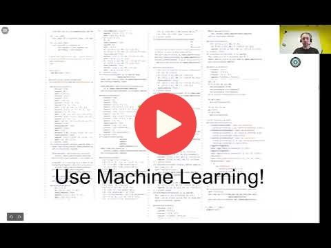

## 1.2 ML vs Rule-Based Systems

[Slides](https://www.slideshare.net/AlexeyGrigorev/ml-zoomcamp-12-ml-vs-rulebased-systems)

## Notes
1. Define what is ML  using a simple supervised classification task. Ok, it is a first approximation.
2. I am wondering what is a good approach to automaticaly define representative features from a unstructered text. Found the term **word embeddings**. Found word2vec, fastText, BERT.
3. I there something similar for speech representation? May be SpeechBERT text-to-speech work. 
4. Found https://github.com/lateral/minkowski. Taking not to revisit in future.

## Navigation

* [Machine Learning Zoomcamp course](../)
* [Lesson 1: Introduction to Machine Learning](./)
* Previous: [Introduction to Machine Learning](01-what-is-ml.md)
* Next: [Supervised Machine Learning](03-supervised-ml.md)

