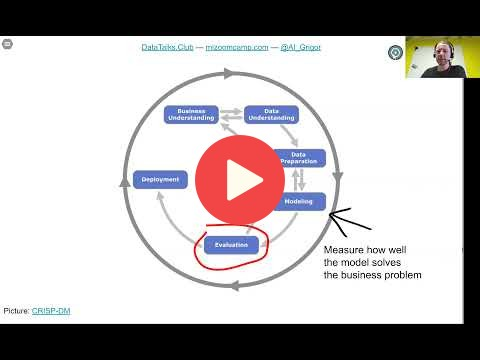

## 1.4 CRISP-DM

[Slides](https://www.slideshare.net/AlexeyGrigorev/ml-zoomcamp-14-crispdm)

## Notes
1. I couldn´t avoid making a parallel with some process descripion from Andrew Ng ML course.

| CRISP-DM machine-learning process | Andrew Ng Lifecycle of an ML project | Andrew Ng steps to scope AI projects |   |
|-----------------------------------|--------------------------------------|--------------------------------------|---|
| Business understanding            | Scope project                        | Identify a business problem          |   |
| Data understanding                |                                      | Brainstorm AI solutions              |   |
|                                   |                                      | Assess feasibility & value           |   |
|                                   |                                      | Determine milestones                 |   |
|                                   |                                      | Budget for resources                 |   |
| Data preparation                  | Collect data                         |                                      |   |
| Modeling, Evaluation              | Train model                          |                                      |   |
| Deployment                        | Deploy in production                 |                                      |   |

2. I agree that presenting a process definition is a good way to approach the topic for an audience of Software Engineers. But I confess my stomach turns just remembering the RUP and ipProcess...

3. Found another interesting board. (From [here](https://blog.grancursosonline.com.br/processo-de-mineracao-de-dados-com-crisp-dm/))

4. Created by IBM. Seems to fit well in simple supervised learning workflows. But seems not to fit well in an inovative solution, where, most of time, the exploration/exploitation is not so structered. Creating ML based assistant, seems not to fit well is this workflow. Now is more clear that CRISP-DM fits well when the objective is building a predictive model.

5. Is there a standard process to build a ai assistant? Not talking about chatbots with steroids. I am imagining bots that could assist you while retouching a picture, cleaning a soundtrack, colorizing a picture, coding, evaluating a risk of decision, designing a physical object. Someting that could help to explore a product development space. 

6. Found [SketchGraphics](https://developer.nvidia.com/blog/ai-helps-predict-and-sketch-computer-aided-design-models/) a generative model. Found [ML4Eng](https://ml4eng.github.io/). This type of project seems not to feet well in crisp-dm workflow.

7. I think that the crisp-dm is so estabiished that it can be automatized. Clean data, select features, try different models... AutoML.

CRISP-DM is a methodology for organizing ML projects. It was invented in the 90s by IBM. The steps of this procedure are: 

1. **Business understanding:** An important question is if do we need ML for the project. The goal of the project has to be measurable. 
2. **Data understanding:** Analyze available data sources, and decide if more data is required. 
3. **Data preparation:** Clean data and remove noise applying pipelines, and the data should be converted to a tabular format, so we can put it into ML.
4. **Modeling:** training Different models and choose the best one. Considering the results of this step, it is proper to decide if is required to add new features or fix data issues. 
5. **Evaluation:** Measure how well the model is performing and if it solves the business problem. 
6. **Deployment:** Roll out to production to all the users. The evaluation and deployment often happen together - **online evaluation**. 

It is important to consider how well maintainable the project is.
  
In general, ML projects require many iterations. 

<table>
   <tr>
      <td>⚠️</td>
      <td>
         The notes are written by the community.  
         If you see an error here, please create a PR with a fix.
      </td>
   </tr>
</table>

CRISP-DM is a methodology for organizing ML projects. It was invented in the 90s by IBM. The steps of this procedure are: 

1. **Business understanding:** An important question is if do we need ML for the project. The goal of the project has to be measurable. 
2. **Data understanding:** Analyze available data sources, and decide if more data is required. 
3. **Data preparation:** Clean data and remove noise applying pipelines, and the data should be converted to a tabular format, so we can put it into ML.
4. **Modeling:** training Different models and choose the best one. Considering the results of this step, it is proper to decide if is required to add new features or fix data issues. 
5. **Evaluation:** Measure how well the model is performing and if it solves the business problem. 
6. **Deployment:** Roll out to production to all the users. The evaluation and deployment often happen together - **online evaluation**. 

It is important to consider how well maintainable the project is.
  
In general, ML projects require many iterations. 

<table>
   <tr>
      <td>⚠️</td>
      <td>
         The notes are written by the community.  
         If you see an error here, please create a PR with a fix.
      </td>
   </tr>
</table>

## Navigation

* [Machine Learning Zoomcamp course](../)
* [Lesson 1: Introduction to Machine Learning](./)
* Previous: [Supervised Machine Learning](03-supervised-ml.md)
* Next: [Model Selection Process](05-model-selection.md)
