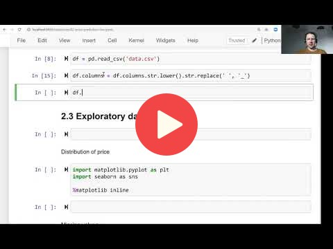

## 2.2 Data preparation

<a href="https://www.youtube.com/watch?v=Kd74oR4QWGM"></a>

[Slides](https://www.slideshare.net/AlexeyGrigorev/ml-zoomcamp-2-slides)


## Notes
1. Clean columns names 
```python
df.columns = df.columns.str.lower().str.replace(' ', '_')

```
2. Clean object columns contents
```python
string_columns = list(df.dtypes[df.dtypes == 'object'].index)

for col in string_columns:
    df[col] = df[col].str.lower().str.replace(' ', '_')

```
Add notes from the video (PRs are welcome)


## Nagivation

* [Machine Learning Zoomcamp course](../)
* [Session 2: Machine Learning for Regression](./)
* Previous: [Car price prediction project](01-car-price-intro.md)
* Next: [Exploratory data analysis](03-eda.md)