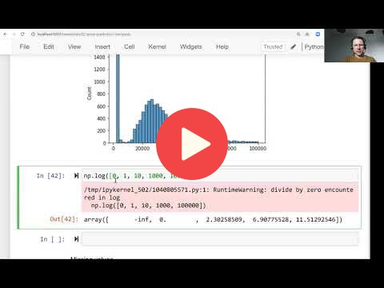

## 2.3 Exploratory data analysis

<a href="https://www.youtube.com/watch?v=k6k8sQ0GhPM"></a>

[Slides](https://www.slideshare.net/AlexeyGrigorev/ml-zoomcamp-2-slides)


## Notes

Add notes from the video (PRs are welcome)

<table>
   <tr>
      <td>⚠️</td>
      <td>
         The notes are written by the community. <br>
         If you see an error here, please create a PR with a fix.
      </td>
   </tr>
</table>

## My notes
1. Questions to ask:
- What are columns names and types? (dtypes)
- Do you need clean spaces from columns names or data values?
- How are object columns? Missing data / NAs? There is some oportunity to transform a object column in a low cardinality categorical feature?
```python
def initial_object_analysis(dataframe):
    '''
    Exploratory data analysis of object columns of a dataframe
    Show nunique, NAs, Top 5 categories for each column
    
    Parameters
    dataframe: a pandas.dataframe    
    '''
    # object_columns = list(dataframe.dtypes[dataframe.dtypes=='object'].index)
    object_columns = [c for c in dataframe.columns if dataframe[c].dtype == 'object']

    for oc in object_columns:
        nunique = dataframe[oc].nunique()
        top5_values = list(dataframe[oc].value_counts()[:5].index)
        top5_percentage = [round((dataframe[oc] == t).sum() / (dataframe[oc]).count() * 100) for t in top5_values]
        others_percentage = 100 - sum(top5_percentage)
        top5_values.append('others')
        top5_percentage.append(others_percentage)
        top5 = [f'{value} {str(percentage)}%' for value, percentage in zip(top5_values,top5_percentage)]
        na = dataframe[oc].isna().sum()
        na_percentage = round(na /(dataframe[oc]).count() * 100)
        
        print(f'|||{oc} - nunique:{nunique} - na:{na}({na_percentage}%)|||')
        print(f'top 5: {top5}\n')
```

- How are numeric columns? Need to feel NULLs? Need to normalize any feature? 
```python
def initial_numeric_analisys(dataframe):
    ''' 
    Exploratory data analysis of numeric columns of a dataframe
    Show nunique, NULLs, frequency distribuition, and log1p version of values

    Parameters
    dataframe: a pandas.dataframe
        
    '''
    numeric_colums = dataframe.select_dtypes(exclude=['object'])

    for nc in numeric_colums:
        figure, axes = plt.subplots(1, 2, figsize=(12, 4))

        sns.histplot(dataframe[nc], bins=40, color='blue', alpha=1, ax=axes[0])

        log1p_value = np.log1p(dataframe[nc])
        sns.histplot(log1p_value, bins=40, color='black', alpha=1, ax=axes[1])

        axes[0].set_title(nc)
        axes[1].set_title(f'Log({nc} + 1) (trying to normalize feature)')

        nunique = dataframe[nc].nunique()
        null = dataframe[nc].isnull().sum()
        null_percentage = round(null /(dataframe[nc]).count() * 100)
        plt.suptitle(f'unique:{nunique} null:{null}({null_percentage}%)') 
        
    plt.show()
```

## Nagivation

* [Machine Learning Zoomcamp course](../)
* [Session 2: Machine Learning for Regression](./)
* Previous: [Data preparation](02-data-preparation.md)
* Next: [Setting up the validation framework](04-validation-framework.md)Kv